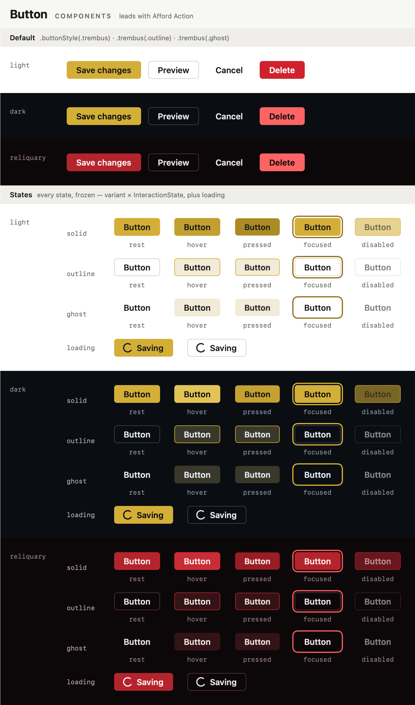

# trembus-swift

[](https://github.com/nicholasosto/trembus-swift/actions/workflows/ci.yml)

A SwiftUI component library for macOS — the Swift sibling of
[`@trembus/ui`](https://github.com/nicholasosto/Trembus-Component-Library).
Same tokens, same three themes, same first-principles contract.



<sub>↑ `make snap NAME=Button` — every variant × every state × every theme, as one picture.</sub>

## The idea

```
   TOKENS ───────────▶ PRIMITIVES ─────────▶ COMPONENTS
   color · space       Surface               Button   (a ButtonStyle)
   type · motion       Pressable             Switch   (a ToggleStyle)
   3 themes            focus ring            Badge · Meter
```

Every component declares — in code the test gate checks — how it does the three jobs of any UI:

| 👁 Reveal State | ☝️ Afford Action | ↩️ Acknowledge Input |
| --- | --- | --- |
| _What is true right now?_ | _What can I do here?_ | _Did it hear me?_ |

## Use it

```swift
import SwiftUI
import TrembusTokens
import TrembusUI

Button("Save") { save() }.buttonStyle(.trembus)
Button("Delete", role: .destructive) { remove() }.buttonStyle(.trembus)   // reads as danger by itself
Toggle("Sync", isOn: $sync).toggleStyle(.trembus)
Badge("Live", tone: .success, showsDot: true)
Meter(value: battery, tone: .levels(dangerBelow: 0.1, warningBelow: 0.25))
Surface(.raised) { Text("A card").foregroundStyle(.theme(.text)) }
```

Nothing to configure. Components follow the system's light/dark appearance on their own, follow
`.controlSize(_:)` like native controls, and honor Reduce Motion, Increase Contrast, and
Differentiate Without Color.

Pin a theme for any subtree:

```swift
ContentView().trembusTheme(.reliquary)
ContentView().trembusTheme(.automatic(dark: .reliquary))   // follow the system, but dark = reliquary
```

Add it to an app — Xcode ▸ _Add Package Dependencies…_ ▸ _Add Local…_ ▸ this folder, or:

```swift
.package(path: "../trembus-swift")
// …then depend on the "TrembusUI" and "TrembusTokens" products
```

## Work on it

```
edit ──▶ make snap ──▶ look at the PNG ──▶ make gallery ──▶ make validate
          see it                             feel it          the gate
```

```bash
make            # list every command
make snap       # PNG sheets of everything  → Snapshots/
make gallery    # the live gallery app
make new NAME=Tag
make validate   # lint + build + test
```

| | |
| --- | --- |
| **Gallery** — `make gallery` | The Storybook equivalent. Hover, press-and-hold, switch themes (⌘1–⌘4). |
| **Snapshots** — `make snap` | Headless. One sheet per entry: every specimen in every theme. |
| **Xcode previews** — `make xcode` | Open any file in `Sources/TrembusCatalog/Entries/` and use the canvas. |
| **The gate** — `make validate` | WCAG contrast for every theme · contract check · every specimen renders · component logic. |

Requires macOS 15+ and Xcode 26+. You do **not** need to run `xcode-select` —
`Scripts/swiftw` finds a working toolchain by itself (`make doctor` explains its choice).

## Layout

```
Sources/
  TrembusTokens/     values only — themes, scales, motion, contrast math
  TrembusUI/         Primitives/ · Components/<Name>/ · Feel/
  TrembusCatalog/    contract + specimens for everything, the snapshot engine
  TrembusGallery/    the live app
  TrembusSnap/       the snapshot CLI
Tests/               the gate
Scripts/             swiftw · gallery · new-component
```

Conventions, and the gotchas that cost real time to find, are in [CLAUDE.md](CLAUDE.md).

## License

[MIT](LICENSE) © Nicholas Osto
